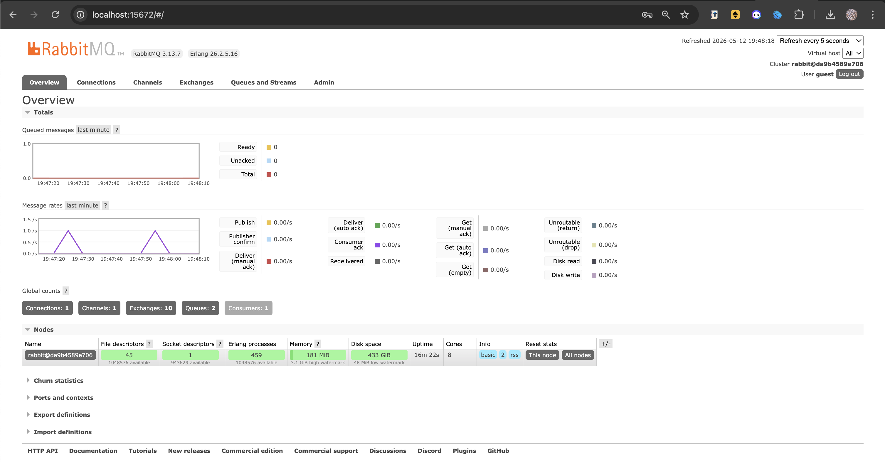

### Understanding Publisher and Message Broker

**a. How much data will your publisher program send to the message broker in one run?**
In one run, the publisher will send exactly 5 events (messages) sequentially to the message broker, one for each user created (Amir, Budi, Cica, Dira, and Emir).

**b. The URL is the same as the subscriber program, what does it mean?**
It means both the publisher and the subscriber are connecting to the exact same AMQP message broker instance running locally on port 5672 using the same credentials. This shared connection point allows the publisher to push messages to a queue that the subscriber is concurrently listening to.

### RabbitMQ Dashboard

### Running the Publisher and Subscriber

**Terminal Outputs:**

**What is happening:**
When the publisher program is executed, it establishes a connection to the RabbitMQ broker and fires off five distinct `UserCreatedEventMessage` events to the `user_created` queue. Because the subscriber program is already running and actively listening to that exact same queue, the message broker instantly routes and pushes those newly arrived events to the subscriber. The subscriber then processes each message and logs the data to the console in real-time, demonstrating a seamless event-driven architecture.

### Monitoring Chart Based on Publisher

**Explanation of the Spike:**
The sudden spike in the "Message rates" chart corresponds directly to the execution of the publisher program. Because I ran the publisher twice in quick succession, it fired a total of 10 events (5 messages per run) into the RabbitMQ broker almost instantly. 

The chart visually captures this exact burst of activity: 
1. The **Publish** rate spikes sharply as the sudden influx of messages enters the broker's queue.
2. The **Deliver** rate spikes simultaneously because the active subscriber instantly pulls those queued messages to process them. 
3. Once all 10 messages are successfully delivered and processed, the traffic drops back to zero, reflecting the system returning to an idle state.