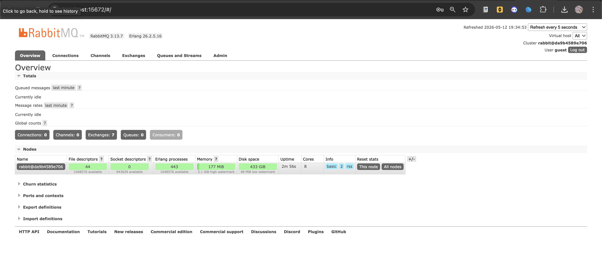

### Understanding Publisher and Message Broker

**a. How much data will your publisher program send to the message broker in one run?**
In one run, the publisher will send exactly 5 events (messages) sequentially to the message broker, one for each user created (Amir, Budi, Cica, Dira, and Emir).

**b. The URL is the same as the subscriber program, what does it mean?**
It means both the publisher and the subscriber are connecting to the exact same AMQP message broker instance running locally on port 5672 using the same credentials. This shared connection point allows the publisher to push messages to a queue that the subscriber is concurrently listening to.

### RabbitMQ Dashboard
